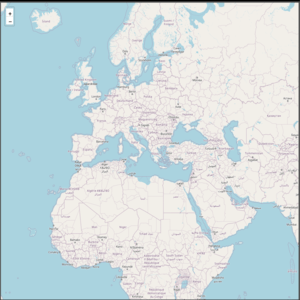

# 2024 DWWM BSM P4

Titre Professionnel  
Développeur Web et Web Mobile
Boulogne sur Mer, Hauts-de-France

## Qui sommes nous

<figure>
    

        
    

    

        <figcaption>
            <a href="https://2024-dwwm-bsm-p4.github.io/trombi-gdu/" align="center">Trombinoscope (Grégoire & Yohann)</a>
        </figcaption>
    

</figure>

## Les technologies utilisées

&nbsp;&nbsp;

&nbsp;&nbsp;

&nbsp;&nbsp;

&nbsp;&nbsp;

&nbsp;&nbsp;

&nbsp;&nbsp;

## Nos réalisations

| Briefs | Technologies | <a href="https://github.com/Pbourgeois62">Philippe</a> | <a href="https://github.com/Florent-Broutin">Florent</a> | <a href="https://github.com/Julie-Charles16">Julie</a> | <a href="https://github.com/Lembont">Térence</a> | <a href="https://github.com/sachadrmn">Sacha</a> | <a href="https://github.com/RetroGreg">Grégoire</a> | <a href="https://github.com/Perrine2023">Perrine</a> | <a href="https://github.com/max-devv">Maxence</a> | <a href="https://github.com/LamourMarine">Marine</a> | <a href="https://github.com/Aledorian">Alédorian</a> | <a href="https://github.com/Marylinelesaffre">Maryline</a> | <a href="https://github.com/bannik62">Yohann</a> |
| :----: | :----: | :----: | :----: | :----: | :----: | :----: | :----: | :----: | :----: | :----: | :----: | :----: | :----: |
| [REAC](https://github.com/2024-dwwm-bsm-p4/reac) |  | <a href="https://github.com/2024-dwwm-bsm-p4/cv-pbo">🟡</a> | <a href="https://github.com/2024-dwwm-bsm-p4/cv-fbr">🔴</a> | <a href="https://github.com/2024-dwwm-bsm-p4/cv-pbo">🟡</a> | <a href="https://github.com/2024-dwwm-bsm-p4/cv-ale">🔵</a> | <a href="https://github.com/2024-dwwm-bsm-p4/cv-fbr">🔴</a> | <a href="https://github.com/2024-dwwm-bsm-p4/cv-gdu">🟠</a> | <a href="https://github.com/2024-dwwm-bsm-p4/cv-ale">🔵</a> | <a href="https://github.com/2024-dwwm-bsm-p4/cv-fbr">🔴</a> | <a href="https://github.com/2024-dwwm-bsm-p4/cv-gdu">🟠</a> | <a href="https://github.com/2024-dwwm-bsm-p4/cv-ale">🔵</a> | <a href="https://github.com/2024-dwwm-bsm-p4/cv-gdu">🟠</a> | <a href="https://github.com/2024-dwwm-bsm-p4/cv-pbo">🟡</a> |
| [CV en ligne](https://github.com/2024-dwwm-bsm-p4/cv) | &nbsp;&nbsp; | <a href="https://2024-dwwm-bsm-p4.github.io/cv-pbo">🔗</a> | <a href="https://2024-dwwm-bsm-p4.github.io/cv-fbr">🔗</a> | <a href="https://2024-dwwm-bsm-p4.github.io/cv-jch">🔗</a> | <a href="https://2024-dwwm-bsm-p4.github.io/cv-tcr">🔗</a> | <a href="https://2024-dwwm-bsm-p4.github.io/cv-sdi">🔗</a> | <a href="https://2024-dwwm-bsm-p4.github.io/cv-gdu">🔗</a> | <a href="https://2024-dwwm-bsm-p4.github.io/cv-pee">🔗</a> | <a href="https://2024-dwwm-bsm-p4.github.io/cv-mhe">🔗</a> | <a href="https://2024-dwwm-bsm-p4.github.io/cv-mla">🔗</a> | <a href="https://2024-dwwm-bsm-p4.github.io/cv-ale">🔗</a> | <a href="https://2024-dwwm-bsm-p4.github.io/cv-mle">🔗</a> | <a href="https://2024-dwwm-bsm-p4.github.io/cv-yva">🔗</a> |
| [Trombinoscope](https://github.com/2024-dwwm-bsm-p4/trombi) | &nbsp;&nbsp; | <a href="https://2024-dwwm-bsm-p4.github.io/Trombi-MLA">🟡</a> | <a href="https://2024-dwwm-bsm-p4.github.io/trombi-fbr">🔴</a> | <a href="https://2024-dwwm-bsm-p4.github.io/trombi-mhe">🔵</a> | <a href="https://2024-dwwm-bsm-p4.github.io/trombi-tcr">🟠</a> | <a href="https://2024-dwwm-bsm-p4.github.io/trombi-tcr">🟠</a> | <a href="https://2024-dwwm-bsm-p4.github.io/trombi-gdu/">⚫</a> | <a href="https://2024-dwwm-bsm-p4.github.io/Trombi-mle/">🟢</a> | <a href="https://2024-dwwm-bsm-p4.github.io/trombi-mhe">🔵</a> | <a href="https://2024-dwwm-bsm-p4.github.io/Trombi-MLA">🟡</a> | <a href="https://2024-dwwm-bsm-p4.github.io/trombi-fbr">🔴</a> | <a href="https://2024-dwwm-bsm-p4.github.io/Trombi-mle/">🟢</a> | <a href="https://2024-dwwm-bsm-p4.github.io/trombi-gdu/">⚫</a> |
| [Tangram](https://github.com/2024-dwwm-bsm-p4/tangram) | &nbsp;&nbsp; | <a href="https://github.com/Lembont/Tangram-TC-PB-GD">🟡</a> | <a href="https://github.com/2024-dwwm-bsm-p4/tangram-mhe">🔴</a> | <a href="https://github.com/2024-dwwm-bsm-p4/tangram-mle">🔵</a> | <a href="https://github.com/Lembont/Tangram-TC-PB-GD">🟡</a> | <a href="https://github.com/2024-dwwm-bsm-p4/tangram-sdi.git">🟢</a> | <a href="https://github.com/Lembont/Tangram-TC-PB-GD">🟡</a> | <a href="https://github.com/2024-dwwm-bsm-p4/tangram-sdi.git">🟢</a> | <a href="https://github.com/2024-dwwm-bsm-p4/tangram-mhe">🔴</a> | <a href="https://github.com/2024-dwwm-bsm-p4/tangram-sdi.git">🟢</a> | <a href="https://github.com/2024-dwwm-bsm-p4/tangram-mle">🔵</a> | <a href="https://github.com/2024-dwwm-bsm-p4/tangram-mle">🔵</a> | <a href="https://github.com/2024-dwwm-bsm-p4/tangram-mhe">🔴</a> |
| [Algorithmie](https://github.com/2024-dwwm-bsm-p4/algorithm) | &nbsp;&nbsp;&nbsp; | <a href="https://github.com/2024-dwwm-bsm-p4/algorithm-pbo">⭐⭐⭐  ⭐⭐</a> | <a href="https://github.com/2024-dwwm-bsm-p4/algorithm-fbr">⭐⭐⭐  ⭐</a> | <a href="https://github.com/2024-dwwm-bsm-p4/algorithm-jch">⭐⭐⭐  ⭐</a> | <a href="https://github.com/2024-dwwm-bsm-p4/algorithm-tcr">⭐⭐⭐  ⭐⭐</a> | <a href="https://github.com/2024-dwwm-bsm-p4/algorithm-sdi">⭐⭐⭐  ⭐</a> | <a href="https://github.com/2024-dwwm-bsm-p4/algorithm-gdu">⭐⭐⭐  ⭐⭐</a> | <a href="https://github.com/2024-dwwm-bsm-p4/algorithm-pee">⭐⭐⭐</a> | <a href="https://github.com/2024-dwwm-bsm-p4/algorithm-mhe">⭐⭐⭐</a> | <a href="https://github.com/2024-dwwm-bsm-p4/algorithm-mla">⭐⭐⭐</a> | <a href="https://github.com/2024-dwwm-bsm-p4/algorithm-ale">⭐⭐⭐  ⭐⭐</a> | <a href="https://github.com/2024-dwwm-bsm-p4/algorithm-mle">⭐⭐⭐  ⭐</a> | <a href="https://github.com/2024-dwwm-bsm-p4/algorithm-yva">⭐⭐⭐</a> |
| [La force d'un mot de passe](https://github.com/2024-dwwm-bsm-p4/password-strength) | &nbsp;&nbsp;&nbsp; | <a href="https://github.com/2024-dwwm-bsm-p4/password-strength-nhe">⭐</a> | <a href="https://github.com/2024-dwwm-bsm-p4/password-strength-nhe">⭐</a> | <a href="https://github.com/2024-dwwm-bsm-p4/password-strength-nhe">⭐</a> | <a href="https://github.com/2024-dwwm-bsm-p4/password-strength-nhe">⭐</a> | <a href="https://github.com/2024-dwwm-bsm-p4/password-strength-nhe">⭐</a> | <a href="https://github.com/2024-dwwm-bsm-p4/password-strength-nhe">⭐</a> | <a href="https://github.com/2024-dwwm-bsm-p4/password-strength-nhe">⭐</a> | <a href="https://github.com/2024-dwwm-bsm-p4/password-strength-nhe">⭐</a> | <a href="https://github.com/2024-dwwm-bsm-p4/password-strength-nhe">⭐</a> | <a href="https://github.com/2024-dwwm-bsm-p4/password-strength-nhe">⭐</a> | <a href="https://github.com/2024-dwwm-bsm-p4/password-strength-nhe">⭐</a> | <a href="https://github.com/2024-dwwm-bsm-p4/password-strength-nhe">⭐</a> |
| [Générateur de mots de passe](https://github.com/2024-dwwm-bsm-p4/password-generator) | &nbsp;&nbsp;&nbsp; | <a href="https://github.com/2024-dwwm-bsm-p4/password-generator-pbo">⭐</a> | <a href="https://github.com/2024-dwwm-bsm-p4/password-generator-fbr">⭐</a> | <a href="https://github.com/2024-dwwm-bsm-p4/password-generator-jch">⭐</a> | <a href="https://github.com/2024-dwwm-bsm-p4/password-generator-tcr">⭐</a> | <a href="https://github.com/2024-dwwm-bsm-p4/password-generator-sdi">⭐</a> | <a href="https://github.com/2024-dwwm-bsm-p4/password-generator-gdu">⭐</a> | <a href="https://github.com/2024-dwwm-bsm-p4/password-generator-pee">⭐</a> | <a href="https://github.com/2024-dwwm-bsm-p4/password-generator-mhe">⭐</a> | <a href="https://github.com/2024-dwwm-bsm-p4/password-generator-mla">⭐</a> | <a href="https://github.com/2024-dwwm-bsm-p4/password-generator-ale">⭐</a> | <a href="https://github.com/2024-dwwm-bsm-p4/password-generator-mle">⭐</a> | <a href="https://github.com/2024-dwwm-bsm-p4/password-generator-yva">⭐</a> |
| [Numéro mystère](https://github.com/2024-dwwm-bsm-p4/mystery-number) | &nbsp;&nbsp;&nbsp; | <a href="https://github.com/2024-dwwm-bsm-p4/mystery-number-pbo">⭐</a> | <a href="https://github.com/2024-dwwm-bsm-p4/mystery-number-fbr">⭐</a> | <a href="https://github.com/2024-dwwm-bsm-p4/mystery-number-jch">⭐</a> | <a href="https://github.com/2024-dwwm-bsm-p4/mystery-number-tcr">⭐</a> | <a href="https://github.com/2024-dwwm-bsm-p4/mystery-number-sdi">⭐</a> | <a href="https://github.com/2024-dwwm-bsm-p4/mystery-number-gdu">⭐</a> | <a href="https://github.com/2024-dwwm-bsm-p4/mystery-number-pee">⭐</a> | <a href="https://github.com/2024-dwwm-bsm-p4/mystery-number-mhe">⭐</a> | <a href="https://github.com/2024-dwwm-bsm-p4/mystery-number-mla">⭐</a> | <a href="https://github.com/2024-dwwm-bsm-p4/mystery-number-ale">⭐</a> | <a href="https://github.com/2024-dwwm-bsm-p4/mystery-number-mle">⭐</a> | <a href="https://github.com/2024-dwwm-bsm-p4/mystery-number-yva">⭐</a> |
| [Monuments](https://github.com/2024-dwwm-bsm-p4/monuments) | &nbsp;&nbsp;&nbsp; | <a href="https://github.com/2024-dwwm-bsm-p4/monuments-pbo">⭐</a> | <a href="https://github.com/2024-dwwm-bsm-p4/monuments-fbr">⭐</a> | <a href="https://github.com/2024-dwwm-bsm-p4/monuments-jch">⭐</a> | <a href="https://github.com/2024-dwwm-bsm-p4/monuments-tcr">⭐</a> | <a href="https://github.com/2024-dwwm-bsm-p4/monuments-sdi">⭐</a> | <a href="https://github.com/2024-dwwm-bsm-p4/monuments-gdu">⭐</a> | <a href="https://github.com/2024-dwwm-bsm-p4/monuments-pee">⭐</a> | <a href="https://github.com/2024-dwwm-bsm-p4/monuments-mhe">⭐</a> | <a href="https://github.com/2024-dwwm-bsm-p4/monuments-mla">⭐</a> | <a href="https://github.com/2024-dwwm-bsm-p4/monuments-ale">⭐</a> | <a href="https://github.com/2024-dwwm-bsm-p4/monuments-mle">⭐</a> | <a href="https://github.com/2024-dwwm-bsm-p4/monuments-yva">⭐</a> |

## Nos projets

| Projets | <a href="https://github.com/Pbourgeois62">Philippe</a> | <a href="https://github.com/Florent-Broutin">Florent</a> | <a href="https://github.com/Julie-Charles16">Julie</a> | <a href="https://github.com/Lembont">Térence</a> | <a href="https://github.com/sachadrmn">Sacha</a> | <a href="https://github.com/RetroGreg">Grégoire</a> | <a href="https://github.com/Perrine2023">Perrine</a> | <a href="https://github.com/max-devv">Maxence</a> | <a href="https://github.com/LamourMarine">Marine</a> | <a href="https://github.com/Aledorian">Alédorian</a> | <a href="https://github.com/Marylinelesaffre">Maryline</a> | <a href="https://github.com/bannik62">Yohann</a> |
| :----: | :----: | :----: | :----: | :----: | :----: | :----: | :----: | :----: | :----: | :----: | :----: | :----: |
| GitHub | <a href="https://github.com/2024-dwwm-bsm-p4/project-pbo">🔗</a> | <a href="https://github.com/2024-dwwm-bsm-p4/project-fbr">🔗</a> | <a href="https://github.com/2024-dwwm-bsm-p4/project-jch">🔗</a> | <a href="https://github.com/2024-dwwm-bsm-p4/project-tcr">🔗</a> | <a href="https://github.com/2024-dwwm-bsm-p4/project-sdi">🔗</a> | <a href="https://github.com/2024-dwwm-bsm-p4/project-gdu">🔗</a> | <a href="https://github.com/2024-dwwm-bsm-p4/project-pee">🔗</a> | <a href="https://github.com/2024-dwwm-bsm-p4/project-mhe">🔗</a> | <a href="https://github.com/2024-dwwm-bsm-p4/project-mla">🔗</a> | <a href="https://github.com/2024-dwwm-bsm-p4/project-ale">🔗</a> | <a href="https://github.com/2024-dwwm-bsm-p4/project-mle">🔗</a> | <a href="https://github.com/2024-dwwm-bsm-p4/project-yva">🔗</a> |
| En&nbsp;ligne | <a href="#">🔗</a> | <a href="#">🔗</a> | <a href="#">🔗</a> | <a href="#">🔗</a> | <a href="#">🔗</a> | <a href="#">🔗</a> | <a href="#">🔗</a> | <a href="#">🔗</a> | <a href="#">🔗</a> | <a href="#">🔗</a> | <a href="#">🔗</a> | <a href="#">🔗</a> |

<!-- &emsp;Briefs :   -->
&emsp;&emsp;[1️⃣ Mon projet](https://github.com/2024-dwwm-bsm-p4/my-project)  
&emsp;&emsp;&emsp;[2️⃣ La vision de mon projet](https://github.com/2024-dwwm-bsm-p4/my-vision)  
&emsp;&emsp;&emsp;&emsp;[3️⃣ ...](https://github.com/2024-dwwm-bsm-p4)  
&emsp;&emsp;&emsp;&emsp;&emsp;[4️⃣ ...](https://github.com/2024-dwwm-bsm-p4)  

<!-- ## Notre avancée

<figure>
    

        
    

    

        <figcaption>
            <a href="#" align="center">Arbre de compétences</a>
        </figcaption>
    

</figure> -->

## Auteurs, contributeurs

* [Nicolas Herbez](https://github.com/nicolas-herbez)
* [Rémy Cottrez](https://github.com/RemyCTRZ)
